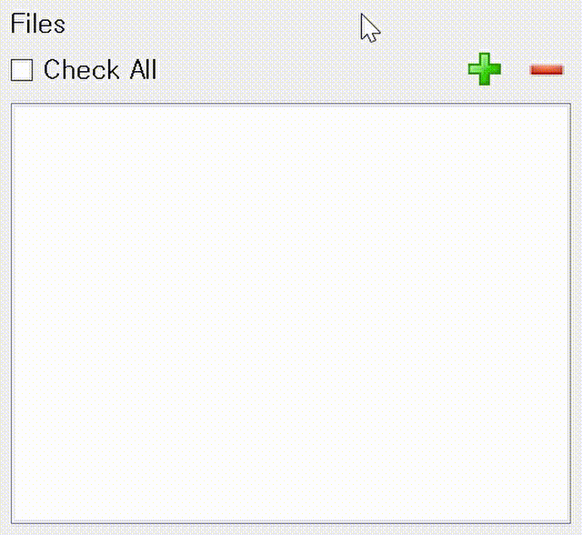

# pyqt-editable-list-widget
Easily editable QListWidget

## Table of Contents
* [General Info](#general-info)
* [Requirements](#requirements)
* [Setup](#setup)
* [Code Example](#code-example)
* [Preview](#preview)

## General Info
In this QListWidget, persistent editor is automatically activated/deactivated.

If you press enter or up or down, Editor will be closed so let you stop editing.

If you want to add the item consecutively when pressing enter, use `setConsecutiveAddWhenEnterPressed(f: bool)`. You can conveniently add a new item. Clicking something else make editor close.

You can edit certain item to double click it or press F2 on the selected item.

Before add item, you have to write `closeIfPersistentEditorStillOpen()`. If you don't, old editor still remain open even though new editor was already opened. 

## Requirements
PyQt5 >= 5.8

## Setup
```
pip install git+https://github.com/yjg30737/editor-list-widget.git --upgrade
```

## Code Example

```python
import sys

from PyQt5.QtCore import Qt
from PyQt5.QtGui import QIcon
from PyQt5.QtWidgets import QPushButton, QApplication, QCheckBox, QDialog,

QVBoxLayout, QListWidgetItem, QWidget, QHBoxLayout, QLabel
from pyqt_editable_list_widget import EditableListWidget


class Dialog(QDialog):
    def __init__(self):
        super().__init__()
        self.__initUi()

    def __initUi(self):
        # topWidget start
        lbl = QLabel('Files')
        lay = QHBoxLayout()
        lay.setAlignment(Qt.AlignLeft)
        lay.addWidget(lbl)
        lay.setContentsMargins(0, 0, 0, 0)

        topWidget = QWidget()
        topWidget.setLayout(lay)
        # topWidget end

        # middleWidget start
        allChkBox = QCheckBox('Check All')

        left_lay = QHBoxLayout()
        left_lay.setAlignment(Qt.AlignLeft)
        left_lay.addWidget(allChkBox)
        left_lay.setContentsMargins(0, 0, 0, 0)

        btn_style = '''
        QPushButton 
        {
        border:0; 
        background:transparent;
        padding:1px;
        }
        QPushButton:hover
        {
        background-color:#DDDDDD;
        border-radius: 2px;
        }
        QPushButton:pressed
        {
        background-color:#FFFFFF;
        border-radius: 2px;
        }
        QPushButton:checked
        {
        background-color: rgb(210, 210, 210);
        border-radius: 2px;
        border: none;
        }
        '''

        addBtn = QPushButton()
        addBtn.clicked.connect(self.__add)
        addBtn.setStyleSheet(btn_style)
        addBtn.setIcon(QIcon('./ico/add.png'))
        addBtn.setToolTip('Add')

        delBtn = QPushButton()
        delBtn.clicked.connect(self.__delete)
        delBtn.setStyleSheet(btn_style)
        delBtn.setIcon(QIcon('./ico/delete.png'))
        delBtn.setToolTip('Delete')

        right_lay = QHBoxLayout()
        right_lay.setAlignment(Qt.AlignRight)
        right_lay.addWidget(addBtn)
        right_lay.addWidget(delBtn)
        right_lay.setContentsMargins(0, 0, 0, 0)

        lay = QHBoxLayout()
        lay.addLayout(left_lay)
        lay.addLayout(right_lay)
        lay.setContentsMargins(0, 0, 0, 0)

        middleWidget = QWidget()
        middleWidget.setLayout(lay)
        # middleWidget end

        # bottomWidget
        self.__bottomWidget = EditableListWidget()

        # mainWidget start
        lay = QVBoxLayout()
        lay.addWidget(topWidget)
        lay.addWidget(middleWidget)
        lay.addWidget(self.__bottomWidget)
        lay.setContentsMargins(0, 0, 0, 0)

        mainWidget = QWidget()
        mainWidget.setLayout(lay)

        lay = mainWidget.layout()
        lay.setContentsMargins(5, 5, 5, 5)

        self.setLayout(lay)
        # mainWidget end

    def __add(self):
        self.__bottomWidget.closeIfPersistentEditorStillOpen()  # You have to call this.
        item = QListWidgetItem('abc')
        self.__bottomWidget.addItem(item)

    def __delete(self):
        item = self.__bottomWidget.currentItem()
        if item:
            self.__bottomWidget.takeItem(self.__bottomWidget.currentRow())


if __name__ == "__main__":
    app = QApplication(sys.argv)
    dialog = Dialog()
    dialog.show()
    sys.exit(app.exec_())
```

## Preview


